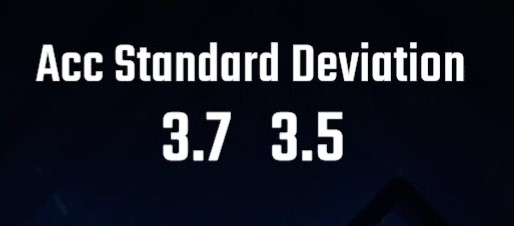

## The English version of the README is [here](README_EN.md)

# AccStandardDeviationCounter

中心精度の標準偏差を表示する[CountersPlus](https://github.com/rynan4818/tournament_overlay)のカスタムカウンターです。

## 依存MOD

- [BSIPA](https://bsmg.github.io/BeatSaber-IPA-Reloaded/)
- [BeatSaberMarkupLanguage](https://github.com/monkeymanboy/BeatSaberMarkupLanguage)(BSML)
- [SiraUtil](https://github.com/Auros/SiraUtil)
- [CounterPlus](https://github.com/Caeden117/CountersPlus)

## インストール方法
1. [Releases]()からAccStandardDeviationCounter.dllをダウンロード
2. AccStandardDeviationCounter.dllをBeat Saberのインストールフォルダ下のPluginsフォルダに追加

Steam版Beat Saberの場合、Pluginフォルダの場所は 
C:\Program Files (x86)\Steam\steamapps\common\Beat Saber\Plugins 
がデフォルトになっています。 
念のため。

## 設定

設定はゲーム内のCounterPlusの設定画面から変更できます。 
より設定値を細かく決めたい場合、 
Beat Saber\UserData\AccStandardDeviationCounter.json 
から値を書き換えて上書き保存してください。

以下それぞれの設定項目とその内容についてです。 
|項目|内容|
|:---|:---|
|SeparateSaber|左右のセイバーに分けて表示するか否か|
|DecimalPrecision|小数点以下何桁までを表示するか|
|EnableLabel|カウンターの上に表示される"Center Distance Counter"の表示をするかどうか|
|LabelFontSize|カウンターの上に表示される"Center Distance Counter"のフォントサイズをどうするか|
|FigureFontSize|カウンターのフォントサイズをどうするか|
|OffsetX|カウンターのx軸方向の位置をどうするか|
|OffsetY|カウンターのy軸方向の位置をどうするか|
|OffsetZ|カウンターのz軸方向の位置をどうするか|
